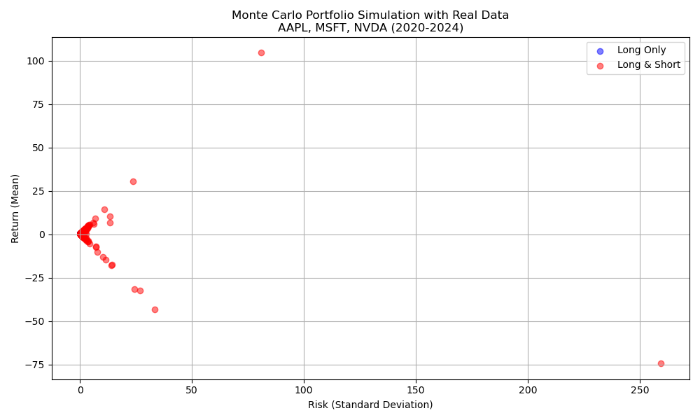

# 📊 Portfolio Optimization via Monte Carlo Simulation  
*AAPL, MSFT, NVDA (2020–2024)*

### Author  
Chenyi Zhao  
Northwestern University  
July 2025

---

## 📘 Project Description

This project explores portfolio optimization strategies through Monte Carlo simulation using real historical data from three major technology stocks: Apple (AAPL), Microsoft (MSFT), and NVIDIA (NVDA), over the period 2020–2024.

The simulation compares **long-only portfolios** (asset weights constrained to [0, 1]) with **long-and-short portfolios** (weights allowed in [−1, 1]), and evaluates how short-selling affects portfolio risk and return. The output includes a visualization of the feasible region and the efficient frontier for each strategy.

---

## 🧮 Methodology

1. Retrieve daily adjusted closing prices using the `yfinance` API.
2. Compute daily returns, and derive:
   - **Annualized expected return** = mean daily return × 252
   - **Annualized volatility** = std dev of daily returns × √252
   - **Annualized covariance matrix**
3. Simulate 700 random portfolio allocations for each of the two strategies:
   - Long-only: weights ∈ [0, 1], sum to 1
   - Long-and-short: weights ∈ [−1, 1], sum to 1
4. Compute expected return and risk for each portfolio:
   - Return: \( \mu_p = w^T \mu \)
   - Risk: \( \sigma_p = \sqrt{w^T \Sigma w} \)
5. Visualize portfolios using `matplotlib`.

---

## 📂 Project Structure

```
portfolio-optimization-monte-carlo/
├── monte_carlo_portfolio.py       # Main Python script
├── portfolio_report.pdf           # Research report
├── portfolio_plot.png             # Output plot image
├── requirements.txt               # Python dependencies
└── README.md                      # Project documentation
```

---

## ▶️ How to Run

### 1. Clone this repository

```bash
git clone https://github.com/yourusername/portfolio-optimization-monte-carlo.git
cd portfolio-optimization-monte-carlo
```

### 2. Install dependencies

```bash
pip install -r requirements.txt
```

### 3. Run the simulation script

```bash
python monte_carlo_portfolio.py
```

This will generate a scatter plot comparing long-only and long-and-short portfolios in terms of risk and return.

---

## 📈 Sample Output



---

## 📑 Report

Please refer to the file [`portfolio_report.pdf`](./portfolio_report.pdf) for a full description of the methodology, results, and key conclusions from the analysis.

---

## 🧠 Use of AI Tools

Generative AI tools were used selectively to assist in:
- Structuring the code and documentation
- Editing and formatting of research explanations
- Ensuring academic clarity in markdown and report content

All outputs were reviewed, validated, and interpreted by the author to ensure alignment with academic standards.

---

## 📚 References

- Markowitz, H. (1952). *Portfolio Selection*. The Journal of Finance.
- Yahoo Finance API via the `yfinance` Python package.
